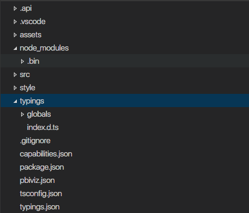
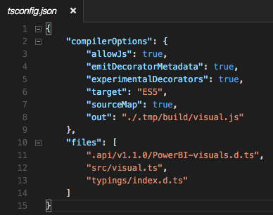
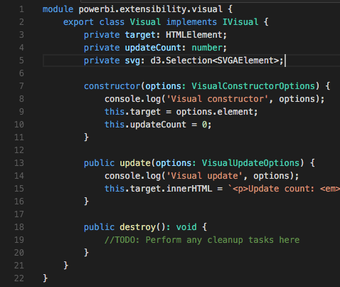

# Installing Typings for d3
Installing typings will give you access to d3 types so you can utilize typescript types.

For a more in depth details about typings, visit their repo. [Typings Documentation](https://github.com/typings/typings)

## Install Typings CLI
In order to use typings in your project, you must first install typings to your computer. This is a one time installation.
```javascript
// install typings globally
npm install typings -g
```
## Add Typings to your Project
To have types for a specific library, run the following command.

* **save** - Persists the types within this project.
* **global** - Tells typings that we want this dependency to be globally available.

```javascript
// install d3 typings 
typings install --save --global dt~d3
```

You should now have a typings directory in your visual project.



## Adding Typings to your PowerBI Visual
Open your `tsconfig.json` file and add your `index.d.ts` to your list of files



## Utilize Types in your Visual
Now you should be able to use types within your code.

